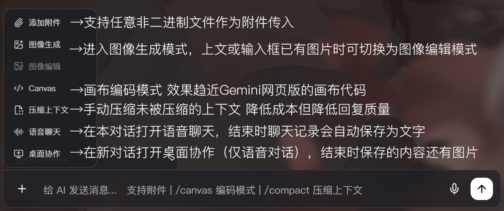

<div align="center">


### Your Next Gen Vibe Coding Toolkit

一个绑定了令牌后即可像大型AI官网那样文字畅聊、语音聊天、共享屏幕、修改代码的前端AI聊天框架。不依赖任何realtime模型，用http调用方法配合STT、TTS、VAD、预设语音等技术实现实时功能。

[](LICENSE)
[]()

</div>

---

## 项目概览

AIUI 是一个以单页前端为核心、同时提供 Electron 桌面壳的 AI 工作台。当前版本重点覆盖以下能力：



- `/canvas` 编码模式：在对话旁直接生成和编辑代码画布。
- 桌面协作模式：透明置顶字幕、点击穿透、全局快捷键截图与语音上下文协作。
- 语音聊天模式：使用 Silero VAD、讯飞流式听写和 Fish Audio HTTP TTS。
- 多模型聊天：可配置 API Key、Base URL、模型列表和默认模型。
- 常驻系统托盘：支持新建或恢复最近会话，并可直接启动语音聊天或桌面协作。
- 语音回放：语音聊天模式生成的 AI 语音可保存并在主对话中回放。
- 附件解析：支持图片、`.docx`、`.pptx`、`.xlsx`、`.txt`、`.md` 等文件。
- 图像生成增强：支持在提示词中写入 `16:9`、`4:3`、`1:1` 等宽高比关键词。
- `/compact` 上下文压缩：支持自动摘要、手动和独立摘要模型。
- Agent Tool Calling：绑定工作区后，可通过标准 JSON 工具调用读取、写入、局部编辑文件并运行 Shell 命令。

---

## 最近更新

### V7.0.0 Canary 7

- 运行中的 AI/Agent 状态改为文字表面的扫描高光，不再为整块提示区域增加背景辉光。
- Agent reasoning 思考记录在当前模型轮次结束后保留，标题由运行提示切换为“思考了 N 秒”，历史重绘后仍然存在。
- Agent 最终正文不再重复挂载同一份 reasoning，思考记录与用户可见答案保持独立顺序。
- 固定 Agent 提示词明确要求：即使任务只需纯文本回答、不调用其他工具，也必须在完整正文后调用一次 `finish_task` 结束循环。
- 增加持久化思考记录与纯文本 `finish_task` 协议回归验证。

### V7.0.0 Canary 6

- AI reasoning 思考过程改为 Agent 同款提示与纯文本流式显示，仅解析 `**加粗**`，并共用详情最大行数设置。
- Agent 设置新增“详细信息默认行为”，可选择默认展开或折叠，流式更新时保留用户当前状态。
- Agent 任务按秒显示 `working for Ns...`，计时跟随最新状态提示；正在思考和运行中的工具提示增加辉光效果。
- 开发者模式的流数据字节统计与调试日志覆盖 Agent 请求；接口返回 501 时自动转接另一端点并显示黄色提示。
- 命令运行确认提示增加内边距，改善命令与操作按钮贴边的问题。

### V7.0.0 Canary 5

- 新增不可退出的 Agent 会话模式，可从加号菜单绑定一个不可更改的工作区目录。
- 新增 `read_file_range`、`write_file`、`edit_file`、`run_shell`、`finish_task` 五个 MVP 工具，支持连续多轮 Agent Loop。
- 工具调用 JSON 不直接显示，改为强调色绿竖线、Lucide 图标和实时状态；完整工具结果保留在后续上下文中。
- 新增 Safe Commands Only / YOLO Mode、一次性授权、始终允许命令前缀与 Agent 设置页。
- 文件工具执行在主进程并校验工作区边界，局部编辑要求唯一匹配；Shell 默认 PowerShell、120 秒超时并支持取消。
- 文件写入和局部编辑提示可展开带颜色的增删差异，Shell 提示可展开命令输出；详情最大行数可设为 10、20、50 或不省略。
- Agent 设置可调整 5 至 3600 秒的命令执行超时；Command Mode 与模型选择器同行，工作区路径与标题同行显示。
- 模型单次回复中的正文与 Tool Calling 会按出现顺序交错渲染，工具 JSON 不再显示或在末尾重复；Shell 中文输出统一为 UTF-8，耗时使用毫秒。
- 命令授权在聊天正文中显示，“始终允许”直接采用自动推导的前缀；Agent 自动压缩轮次按已完成用户任务统计。
- 修复后续 Agent 任务中 Tool Calling JSON 重复渲染、被 KaTeX 处理，以及 `<json>` 包装和多余空行泄漏到正文的问题。
- Agent 流式响应按 SSE 事件编号去重；`finish_task` 提示固定显示在最终正文与模型/复制页脚之间。
- Agent 的 `/responses` 请求保留结构化消息角色，不再把历史压成带 `user:`/`assistant:` 标签的单个字符串，避免兼容服务回显完整提示词。
- 协议解析兼容 `<.../>`、DSML 分隔符和扁平 `tool_call` 变体；回显的 `ToolResult`、工具结果 JSON 与内部提示不会进入聊天正文。
- 兼容模型将最终正文放在 `finish_task` 后面的情况，界面仍按“最终正文 → 任务完成 → 模型/复制”显示。

### V6.3.0 Release

- Setup 版完成自动更新检查且当前已是最新版本时，“关于信息”会在版本号后显示绿色“当前已是最新版本”。

### V6.2.0 Release

- Windows Setup 安装版接入 `electron-updater`，启动时可自动检查 GitHub Release。
- 新增默认开启的“自动探测更新”设置；Portable 版本不会进行自动更新检查。
- 发现更新后使用系统原生对话框确认下载，并利用 NSIS blockmap 执行差分更新。
- “关于信息”会在存在新版本时显示可用版本号。

### V6.1.0 Release

- 修复 AI 消息和用户消息渲染链路中的 XSS 漏洞，原始 HTML 会转义显示为可见文本而不是被删除；统一使用 DOM 清洗后写入页面，阻止 `<script>`、事件属性和 `javascript:` 链接等注入向量。
- 附件预览改为 DOM 属性赋值渲染，文件名与图片地址不再直接拼接进 HTML，进一步降低用户输入导致的注入风险。

### V6.0.0 Release

### V6.0.0 Canary 3

- 修复桌面协作字幕向左移动后右侧文字仍被截断的问题，改用真实横向滚动并随流式文本实时刷新位置。
- AI 字幕只在开始朗读无法完整显示的当前语句时滚动，已完整显示的前置语句保持静止。
- 用户语音识别字幕持续跟随最新部分识别文字。

### V6.0.0 Canary 2

- 大图预览打开与关闭增加淡入淡出动画。
- 修复桌面协作播放 AI 语音时被 VAD 自我识别的问题；新增“跳过B组语音”设置，默认关闭。
- 桌面协作字幕改为横向自动滚动，避免用省略号隐藏完整句子。

### V6.0.0 Canary

- 新增桌面协作独立窗口，主窗口自动最小化，透明字幕停靠当前显示器底部。
- 新增可配置全局传图快捷键与截图精细度；截图在下一次语音输入时随消息发送。
- 语音聊天与桌面协作统一跟随主界面 API endpoint，支持 Responses 501 自动回退。
- 新增常驻托盘菜单、最近会话启动、开发者日志操作和关闭主窗口后继续驻留。
- 预制语音新增 C 组，截图请求会在 A 组后必定播放一条 C 组语音。

### V5.7.0 Alpha

- 修复对/chat/completions接口的回复内容渲染逻辑问题。
- 修复对/responses接口回复内容分类判定不精确的问题。
- 用户选择/responses端口若遇到501错误将自动回退/chat/completions。


完整记录见 [UPDATE.md](UPDATE.md)。

---

## 核心功能

### 1. Canvas 编码模式


- 在输入框发送 `/canvas` 后，右侧进入代码画布模式。
- 画布基于 CodeMirror，支持语法高亮、行号与手动编辑。
- AI 可通过 `[replace]` 风格的替换指令精确修改画布内容。

### 2. 语音聊天模式


- 独立 `audiochat.html` 页面，采用上下双分区字幕布局。
- 上半区显示 AI 字幕，下半区显示用户识别文本。
- AI 字幕支持按句自动跟随与逐句淡入。
- 语音聊天生成的 AI 语音可在主对话中按整次回复连续回放。
- 可在偏好设置中一键清除历史语音记录，不影响预制语音与后续新记录。
- 语音聊天可以从文字对话中途开始也可以之后转成文本继续对话。

### 3. 桌面协作模式


- 透明、无边框、始终置顶的横向字幕窗口默认停靠当前显示器底部。
- AI 与用户语音内容各占一行，白色字幕使用黑色文字阴影保证可读性。
- 除“结束对话”按钮区域外，窗口允许鼠标操作穿透到下层桌面。
- 全局传图快捷键默认是 `Ctrl+A`，截图精细度默认使用 1920px / JPEG 85。
- 多次截图只保留最后一张，并在下一次语音输入时作为用户消息附件发送。
- 可在偏好设置中开启自动传图；每轮语音结束后若没有手动截图，会自动截取鼠标所在显示器。
- 结束协作后，文字、AI 语音记录和截图会写回对应主会话。

### 4. 自动更新

- 仅 Windows Setup 安装版启用，Portable 版本和开发环境会跳过更新检查。
- “自动探测更新”默认开启，可在偏好设置“其他”中关闭。
- 启动时通过 GitHub Release 的 `latest.yml` 比较版本；发现更新后使用系统原生对话框询问用户。
- 下载阶段由 `electron-updater` 使用 Setup 对应的 `.blockmap` 自动执行差分更新。
- 每次 GitHub Release 必须同时上传 Setup 安装包、Setup `.blockmap` 和 `latest.yml`。

### 5. 多模型与 API 配置


- 支持自定义 Base URL、API Key、模型列表和默认模型。
- 模型配置保存在本地，适合长期个人环境使用。
- 主界面、语音聊天和桌面协作均支持 `/responses` 与 `/chat/completions`。
- `/responses` 返回 501 时会自动使用 `/chat/completions` 重试。

### 6. 图像与附件工作流

- 支持图片粘贴、图片上传和常见 Office 文档解析。
- 图像请求支持提示词中的宽高比关键词。
- 附件内容会在提取后注入当前对话上下文。

### 7. 上下文压缩

- 可在长对话中自动或手动压缩上下文。
- 摘要用于降低发送给模型的上下文长度，不覆盖原始聊天记录。

---

## 运行方式

### 浏览器方式

直接打开 `index.html` 即可运行基础前端界面。

### Electron 方式

```bash
npm install
npm start
```

---

## 以 Windows 为例的桌面应用构建

项目当前使用 `electron-builder` 生成以下 Windows 产物：

- Portable：`AIUI7.0.0-Canary7-Portable.exe`
- Setup：`AIUI7.0.0-Canary7-Setup.exe`

构建命令：

```bash
npm run build
```

构建输出目录：`dist/`

---

## 主要文件

- `index.html`：主对话界面与前端逻辑
- `audiochat.html`：语音聊天界面
- `desktopwork.html`：桌面协作窗口入口
- `voicechat-api.js`：独立语音/协作窗口共用 API 适配层
- `main.js`：Electron 主进程
- `preload.js`：Electron 预加载桥接
- `agent-protocol.js`：Agent Tool Calling 协议常量、连续 JSON 对象解析和固定提示前缀
- `agent-tools.js`：主进程工作区校验、文件工具、Shell 执行器和命令白名单
- `agent-ui.js`：Agent Loop、工具结果持久化、授权交互和工具状态渲染
- `alwaysAllowedCommand.txt`：内置安全命令前缀（用户增项保存在 Electron userData）
- `package.json`：版本、脚本与构建配置
- `UPDATE.md`：版本更新记录

---

## 版本信息

- 当前版本：`V7.0.0 Canary 7`
- 当前构建标识：`build20260814`

---

## License

本项目基于 [MIT License](LICENSE) 发布。
