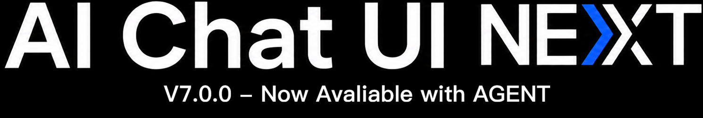
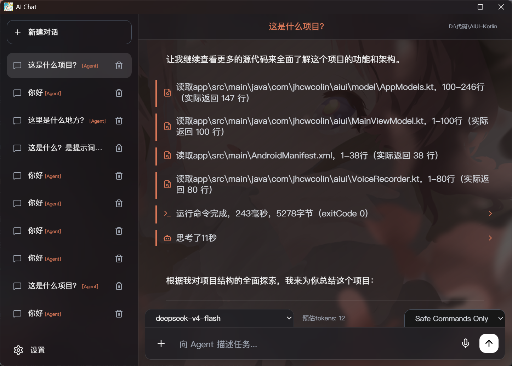

<div align="center">





### Your Next Gen Vibe Coding Toolkit

基于前端页面与 Electron 的 AI 对话桌面应用，覆盖文字聊天、Canvas 编码、语音聊天、附件解析、图像生成与 Windows 本地打包。

[](LICENSE)
[]()

</div>

---

## 项目概览

AIUI 是一个以单页前端为核心、同时提供 Electron 桌面壳的 AI 工作台。当前版本重点覆盖以下能力：

- `/canvas` 编码模式：在对话旁直接生成和编辑代码画布。
- 多模型聊天：可配置 API Key、Base URL、模型列表和默认模型。
- 语音聊天模式：使用 Silero VAD、讯飞流式听写和 Fish Audio HTTP TTS。
- 语音回放：语音聊天模式生成的 AI 语音可保存并在主对话中回放。
- 附件解析：支持图片、`.docx`、`.pptx`、`.xlsx`、`.txt`、`.md` 等文件。
- 图像生成增强：支持在提示词中写入 `16:9`、`4:3`、`1:1` 等宽高比关键词。
- 上下文压缩：支持自动摘要、手动 `/compact` 和独立摘要模型。

---

## 最近更新


## V5.6.0

- 修复手动停止 AI 生成后，灵动岛通知仍然常驻的问题；现在会像正常回复结束一样在短暂时间后自动消失。
- 继续完善 Responses API 的流式输出兼容，已能正确返回非流式回复，并在收到增量内容时实时刷新消息内容。
- 微调设置内容的布局。

### V5.5.0

- 回放灵动岛改为单行通知高度，只显示整段回复进度和图标控制键。
- 回放会按顺序连续播放该次 AI 回复中全部成功生成的语音句子。
- 修复清除语音记录后播放条闪现，以及首条语音播放前字幕定位到最后一句的问题。

### V5.4.0

- 语音聊天模式生成的 AI 语音现在会保存到 IndexedDB。
- 主对话中，来自语音聊天模式的 AI 回复会显示“回放”按钮。
- 新增顶部“灵动岛”式回放条，支持暂停、停止、拖动整段回复进度和自动切换播放。
- 偏好设置“其他”新增“清除语音记录”，会通过自定义警告弹窗删除所有非预制语音记录。

### V5.3.0

- 语音聊天字幕字号和行距微调。
- AI 字幕支持按句自动跟随滚动，用户手动滚动 5 秒后恢复自动模式。
- AI 字幕改为每句完成后淡入，人类字幕取消淡入。
- 偏好设置和压缩上下文确认弹窗新增淡入 / 淡出过渡。

完整记录见 [UPDATE.md](UPDATE.md)。

---

## 核心功能

### 1. Canvas 编码模式


- 在输入框发送 `/canvas` 后，右侧进入代码画布模式。
- 画布基于 CodeMirror，支持语法高亮、行号与手动编辑。
- AI 可通过 `[replace]` 风格的替换指令精确修改画布内容。

### 2. 语音聊天模式


- 独立 `audiochat.html` 页面，采用上下双分区字幕布局。
- 上半区显示 AI 字幕，下半区显示用户识别文本。
- AI 字幕支持按句自动跟随与逐句淡入。
- 语音聊天生成的 AI 语音可在主对话中按整次回复连续回放。
- 可在偏好设置中一键清除历史语音记录，不影响预制语音与后续新记录。
- 语音聊天可以从文字对话中途开始也可以之后转成文本继续对话。


### 3. 多模型与 API 配置

- 支持自定义 Base URL、API Key、模型列表和默认模型。
- 模型配置保存在本地，适合长期个人环境使用。

### 4. 图像与附件工作流

- 支持图片粘贴、图片上传和常见 Office 文档解析。
- 图像请求支持提示词中的宽高比关键词。
- 附件内容会在提取后注入当前对话上下文。

### 5. 上下文压缩

- 可在长对话中自动或手动压缩上下文。
- 摘要用于降低发送给模型的上下文长度，不覆盖原始聊天记录。

---

## 运行方式

### 浏览器方式

直接打开 `index.html` 即可运行基础前端界面。

### Electron 方式

```bash
npm install
npm start
```

---

## Windows 构建

项目当前使用 `electron-builder` 生成以下 Windows 产物：

- Portable：`AIUI5.6.0-Portable.exe`
- Setup：`AIUI5.6.0-Setup.exe`

构建命令：

```bash
npm run build
```

构建输出目录：`dist/`

---

## 主要文件

- `index.html`：主对话界面与前端逻辑
- `audiochat.html`：语音聊天界面
- `main.js`：Electron 主进程
- `preload.js`：Electron 预加载桥接
- `package.json`：版本、脚本与构建配置
- `UPDATE.md`：版本更新记录

---

## 版本信息

- 当前版本：`V5.6.0`
- 当前构建标识：`build20260803`

---

## License

本项目基于 [MIT License](LICENSE) 发布。
