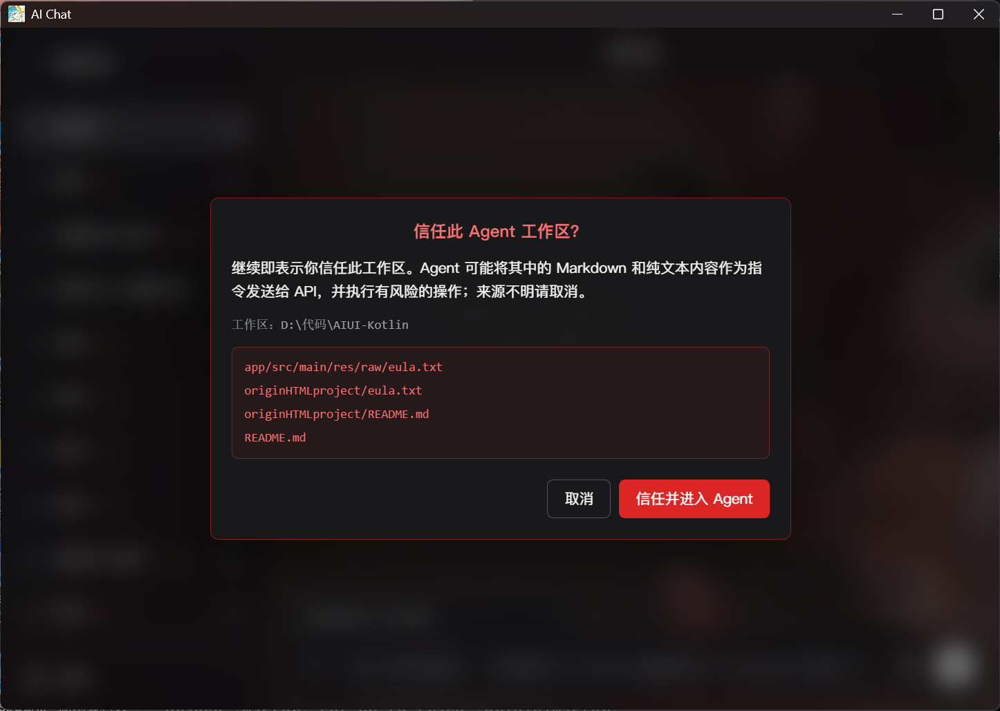
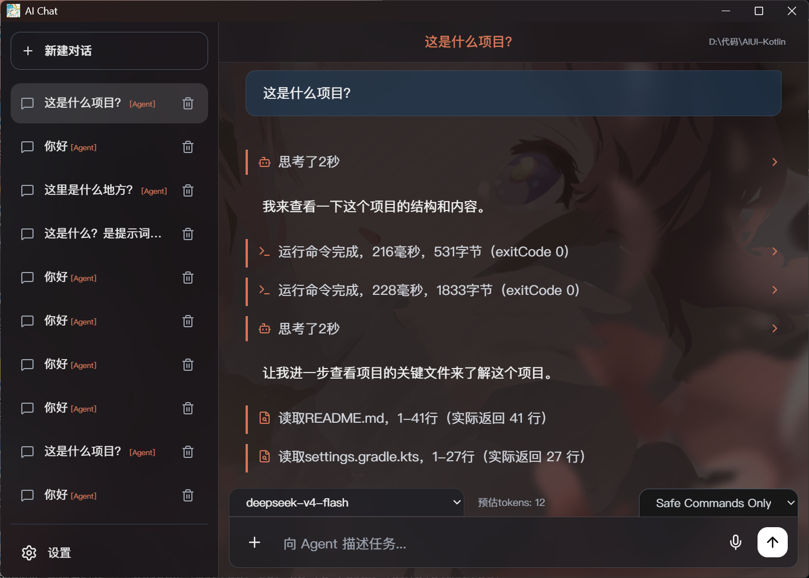
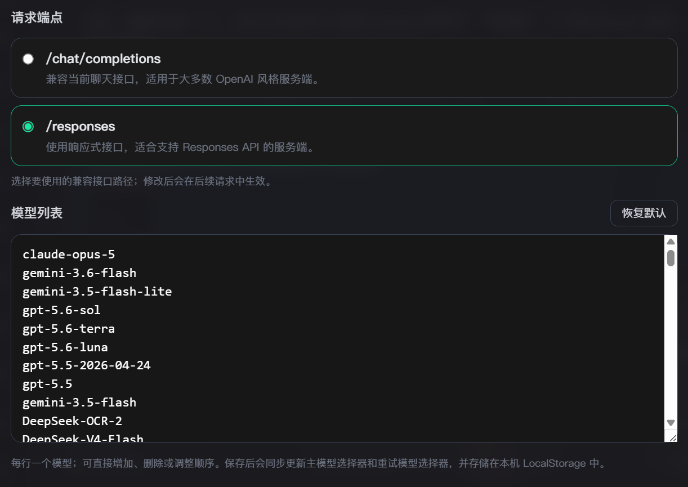

<div align="center">


# Your Next Gen Vibe Coding Toolkit
# Free Yourself with AGENT

一个绑定了令牌后即可像大型AI官网那样Agent服务、文字畅聊、语音聊天、共享屏幕、修改代码的前端AI聊天框架。不依赖任何realtime模型，用http调用方法配合STT、TTS、VAD、预设语音等技术实现实时功能。

[](LICENSE)
[]()
[]()

</div>

---

## 项目概览

AIUI 是一个以单页前端为核心、同时提供 Electron 桌面壳的 AI 工作台。当前版本重点覆盖以下能力：

- Agent工作流：让AI帮你直接修改文件、运行指令、读取文件等操作。
- `/canvas` 编码模式：在对话旁直接生成和编辑代码画布。
- 桌面协作模式：透明置顶字幕、点击穿透、全局快捷键截图与语音上下文协作。
- 语音聊天模式：使用 Silero VAD、讯飞流式听写和 Fish Audio HTTP TTS。
- 多模型聊天：可配置 API Key、Base URL、模型列表和默认模型。
- 常驻系统托盘：支持新建或恢复最近会话，并可直接启动语音聊天或桌面协作。
- 语音回放：语音聊天模式生成的 AI 语音可保存并在主对话中回放。
- 附件解析：支持图片、`.docx`、`.pptx`、`.xlsx`、`.txt`、`.md` 等文件。
- 图像生成增强：支持在提示词中写入 `16:9`、`4:3`、`1:1` 等宽高比关键词。
- `/compact` 上下文压缩：支持自动摘要、手动和独立摘要模型。
- Agent Tool Calling：绑定工作区后，可通过标准 JSON 工具调用读取、写入、局部编辑文件并运行 Shell 命令。

---

## 最近更新

### V7.3.0 Release 增强中日韩解析能力

### V7.3.0 Release 修改Agent核心提示词

### V7.2.0 Release 修复缓存命中问题

### V7.1.0 Release 兼容Codex Claude Gemini的原生格式
- 当模型不遵循我们的工具调用规则，使用自家的agent工具的工具调用格式，我们也会支持。
- 全方位提升Agent体验，解决了大部分文本错位，正文被当作报错，连续产生空回复的问题。

### V7.0.0 Release Agent正式上线
- Agent 工作区选择后新增信任确认，自动扫描非依赖目录中的 `.txt` 与 `.md` 文件，并显示最多 5 个风险文件路径。
- Agent 首次触发自动上下文压缩前会询问用户，可直接改为不压缩、每 10、15 或 20 轮压缩，或保持当前设置。
- Agent 偏好设置新增内测与 API 分组兼容性警告，所有全屏 Agent 提示统一使用弹入弹出动画。
- Agent 固定提示词现在在会话创建时生成并持久化，包含稳定的会话开始时间。
- 删除每轮请求中插入的动态时间消息，避免第二次提问时改变已有前缀。
- 已存在的旧 Agent 会话会在下一次请求时补入该约束，之后保持不变。
- 普通聊天也会保存会话级 promptPrefix，后续只追加历史消息。
- 每个会话生成稳定的 prompt_cache_key，不同会话不会共用。
- /responses 端点现在保留 prompt_cache_key。


完整记录见 [UPDATE.md](UPDATE.md)。

---

## 核心功能

### 1. Agent 工作流




- 点击“+”进入Agent模式，绑定工作区后AI可以在此工作区内行动。
- AI通过五个基础工具来帮你操作本地文件，包括增查改删（CRUD）和运行指令，以及结束任务的工具。
- 处于Agent模式的会话不可退出。
- 用户可以选择指令运行的安全审查方式：仅安全指令和完全访问（YOLO Mode）。

### 2. Canvas 编码模式


- 在输入框发送 `/canvas` 后，右侧进入代码画布模式。
- 画布基于 CodeMirror，支持语法高亮、行号与手动编辑。
- AI 可通过 `[replace]` 风格的替换指令精确修改画布内容。

### 3. 语音聊天模式


- 独立 `audiochat.html` 页面，采用上下双分区字幕布局。
- 上半区显示 AI 字幕，下半区显示用户识别文本。
- AI 字幕支持按句自动跟随与逐句淡入。
- 语音聊天生成的 AI 语音可在主对话中按整次回复连续回放。
- 可在偏好设置中一键清除历史语音记录，不影响预制语音与后续新记录。
- 语音聊天可以从文字对话中途开始也可以之后转成文本继续对话。

### 4. 桌面协作模式


- 透明、无边框、始终置顶的横向字幕窗口默认停靠当前显示器底部。
- AI 与用户语音内容各占一行，白色字幕使用黑色文字阴影保证可读性。
- 除“结束对话”按钮区域外，窗口允许鼠标操作穿透到下层桌面。
- 全局传图快捷键默认是 `Ctrl+A`，截图精细度默认使用 1920px / JPEG 85。
- 多次截图只保留最后一张，并在下一次语音输入时作为用户消息附件发送。
- 可在偏好设置中开启自动传图；每轮语音结束后若没有手动截图，会自动截取鼠标所在显示器。
- 结束协作后，文字、AI 语音记录和截图会写回对应主会话。

### 5. 自动更新

- 仅 Windows Setup 安装版启用，Portable 版本和开发环境会跳过更新检查。
- “自动探测更新”默认开启，可在偏好设置“其他”中关闭。
- 启动时通过 GitHub Release 的 `latest.yml` 比较版本；发现更新后使用系统原生对话框询问用户。
- 下载阶段由 `electron-updater` 使用 Setup 对应的 `.blockmap` 自动执行差分更新。
- 每次 GitHub Release 必须同时上传 Setup 安装包、Setup `.blockmap` 和 `latest.yml`。

### 6. 多模型与 API 配置



- 支持自定义 Base URL、API Key、模型列表和默认模型。
- 模型配置保存在本地，适合长期个人环境使用。
- 主界面、语音聊天和桌面协作均支持 `/responses` 与 `/chat/completions`。
- `/responses` 返回 501 时会自动使用 `/chat/completions` 重试。

### 7. 图像与附件工作流

- 支持图片粘贴、图片上传和常见 Office 文档解析。
- 图像请求支持提示词中的宽高比关键词。
- 附件内容会在提取后注入当前对话上下文。

### 8. 上下文压缩

- 可在长对话中自动或手动压缩上下文。
- 摘要用于降低发送给模型的上下文长度，不覆盖原始聊天记录。

---

## 运行方式

### 浏览器方式

直接打开 `index.html` 即可运行基础前端界面。

### Electron 方式

```bash
npm install
npm start
```

---

## 以 Windows 为例的桌面应用构建

项目当前使用 `electron-builder` 生成以下 Windows 产物：

- Portable：`AIUI7.4.0-Release-Portable.exe`
- Setup：`AIUI7.4.0-Release-Setup.exe`

构建命令：

```bash
npm run build
```

构建输出目录：`dist/`


---

## 版本信息

- 当前版本：`V7.4.0 Release`
- 当前构建标识：`build20260829`

---

## License

本项目基于 [MIT License](LICENSE) 发布。
